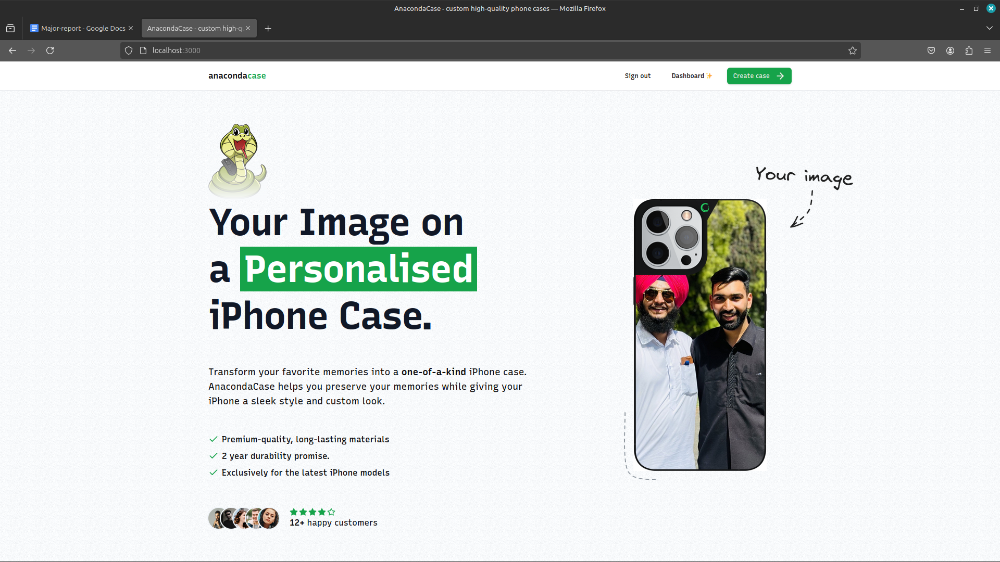

## Anaconda Case 📱🐍
 
_A Modern E-Commerce Store for Custom Phone Cases._ 

Anaconda Case is a feature-rich e-commerce platform designed for customers to create fully personalized phone cases with ease. Built from scratch using modern technologies like **Next.js 14**, **TypeScript**, and **NeonDB**, this platform combines seamless functionality with a sleek UI for an unparalleled shopping experience 📱🐍. 

---

### Features 👀

#### 🛍️ **Shop & Customize**  
- **Custom Configurator**: Personalize phone cases with uploaded images, colors, and materials.
- **Live Preview**: See your custom case design before purchase.
- **Responsive Design**: Accessible across all devices, from mobile to desktop.

#### 🎨 **User Experience**  
- **Drag-and-Drop Uploads**: Effortlessly upload your images.
- **Apple-Inspired UI**: Clean, modern, and intuitive interface.
- **Dark Mode Support**: Aesthetic light and dark themes.

#### 🛠️ **Admin Tools**  
- **Admin Dashboard**: View and manage orders, analyze sales trends, and set goals.

#### 🌟 **Other Highlights**  
- **Stripe Integration**: Secure, hassle-free payments.
- **Authentication**: Powered by **Kinde** for secure user logins.
- **Eco-Friendly Packaging**: Materials made from recycled products.

#### 🎁 **...much more**

---

### Technologies Used 🚀
  
- **Frontend**: Next.js 14, TypeScript, Shadcn UI
- **Backend**: NeonDB (PostgreSQL NoSQL), UploadThing for file uploads
- **Payments**: Stripe API
- **Auth**: Kinde

### 📋 **How It Works**  
1. **Upload Your Image**: Drag and drop or select images to start designing.
2. **Customize Your Case**: Resize, reposition, and choose color/material options.
3. **Preview & Purchase**: Review the final design, check pricing, and complete your purchase.
4. **Receive Updates**: Stay informed with order tracking and updates.

---

### Test Credit Card 💳

No need to make Payment, you can us test card provided by Stripe for testing payments. These cards work in test mode and do not involve any real transactions.

- **Basic Test Card** Card Number : 4242 4242 4242 
Expiry Date : 12/34 CVV: 123

- **Declined Card** Card Number : 4000 0000 0000 
Expiry Date : 12/35 CVV: 123

### Future Enhancements ✨
- AI-powered design suggestions.
- Multilingual and multi-currency support. 
- Expanded device compatibility (Samsung, Google Pixel). 

thank you, Happy Coding !!

